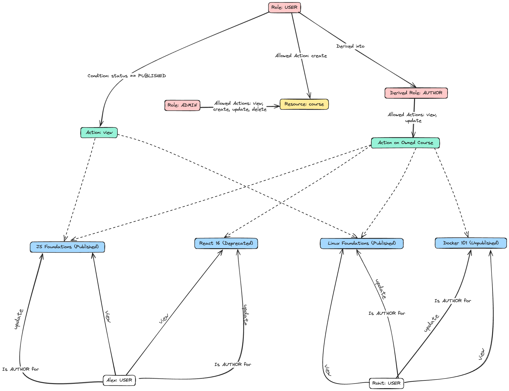

<h1 align="center">Cerbos React Demo</h1>

<p align="center">
  React-based web application that uses Cerbos for smooth authorization.
</p>



## Introduction

This is a React-based web application that provides a platform for users to view and manage courses. The application uses Cerbos for authorization.


## Tech Stack

- [React](https://react.dev/) – library for building UI
- [Cerbos](https://www.cerbos.dev/) – Authorization Service
- [Node.js](https://nodejs.org/) – JavaScript runtime
- [docker](https://www.docker.com/) - Containerization platform
- [Git](https://git-scm.com/) – versioning
- [pnpm](https://pnpm.io/) – efficient package manager

## Example usage

- First, create an [HTTP](https://github.com/cerbos/cerbos-sdk-javascript/blob/main/packages/http/README.md) or [embedded](https://github.com/cerbos/cerbos-sdk-javascript/blob/main/packages/embedded/README.md) Cerbos client, and provide it to your application's components using [`CerbosProvider`](https://github.com/cerbos/cerbos-sdk-javascript/blob/main/docs/react.cerbosprovider.md): We recommend using Embedded Cerbos client for this particular demo.

- Hence, We're using the Cerbos client created with the embedded provider and passing it to the CerbosProvider, you can [view it here](src/App.jsx)

## Local Development Setup

0.  **Prerequisites**

    Make sure you have the following installed on your machine:

    - [Git](https://git-scm.com/)
    - [Node.js](https://nodejs.org/en)
    - [docker](https://www.docker.com/)
    - [Cerbos 0.16+](https://cerbos.dev)
    - [Cerbos Hub](https://hub.cerbos.cloud/)

    If you are going with [embedded](https://github.com/cerbos/cerbos-sdk-javascript/blob/main/packages/embedded/README.md) Cerbos client then we need bundle url

<div align="center">
	
</div>

1.  **Clone the repository:**

    ```bash
    git clone https://github.com/cerbos/react-cerbos-demo.git
    ```

2.  **Navigate to the project directory in your terminal:**

    ```bash
    cd cerbose-react-demo
    ```

3.  **Add Environment Variables:**

   - Create `.env` file in the root folder and copy paste the content of `.env.sample`.
   - Add `VITE_CERBOS_BUNDLE_URL="<bundle-url>"` variable and replace `<bundle-url>` with the bundle URL from Cerbos Hub.
   
   ```bash
    cp .env.sample .env
   ```

   If required, add/replace credentials.

4.  **Install dependencies:**

    ```bash
    npm install
    ```

5.  **Start the app**

    ```bash
    npm run dev
    ```

6.  **Open your browser:**

    Visit [http://localhost:5173](http://localhost:5173) to explore the courses application.

7.  Use the login credentials provided in the `seed.js` file.

<br>

## 🐳&nbsp;&nbsp; Run with Docker

0. **Prerequisites**

   Make sure you have the [Docker](https://www.docker.com/) installed on your machine.

1. **Clone the repository:**

   ```bash
   git clone https://github.com/rohitg00/cerbos-react-demo.git
   ```

2. **Navigate to the project directory:**

   ```bash
   cd cerbos-react-demo
   ```

3. **Add Environment Variables:**

   Create .env file in the root folder and copy paste the content of .env.sample.

   ```bash
   cp .env.sample .env
   ```

   If required, add/replace credentials.

4. **Start the server using Docker Compose:**

   ```bash
   docker-compose up

   # then press 'w' to Enable Watch (For Hot Reloading)
   ```

<br>

## Contributing

Contributions are always welcome! Feel free to open issues or submit PRs.
