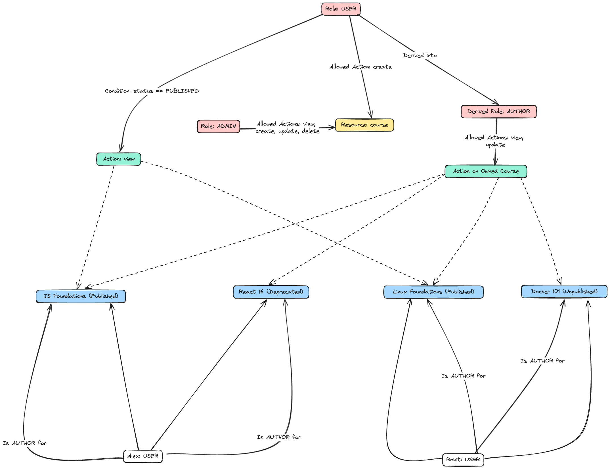
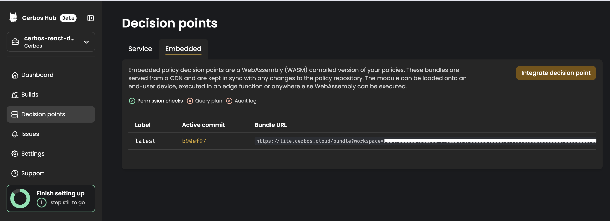

<h1 align="center">Cerbos React Demo</h1>

<p align="center">
  React-based web application that uses Cerbos for smooth authorization.
</p>



## Introduction

This is a React-based web application that provides a platform for users to view and manage courses. The application uses Cerbos for authorization.

## Tech Stack

- [React](https://react.dev/) – library for building UI
- [Cerbos](https://www.cerbos.dev/) – Authorization Service
- [Node.js](https://nodejs.org/) – JavaScript runtime
- [docker](https://www.docker.com/) - Containerization platform  
- [Git](https://git-scm.com/) – versioning
- [pnpm](https://pnpm.io/) – efficient package manager

## Local Development

0.  **Prerequisites**

    Make sure you have the following installed on your machine:

    - [Git 16.13+](https://git-scm.com/)
    - [Node.js](https://nodejs.org/en)
    - [pnpm](https://pnpm.io/)
    - [docker](https://www.docker.com/)
	- [Cerbos 0.16+](https://cerbos.dev)
	- [Cerbos Hub](https://hub.cerbos.cloud/)

## Installation

```console
$ npm install @cerbos/react
```

## Example usage

First, create an [HTTP](https://github.com/cerbos/cerbos-sdk-javascript/blob/main/packages/http/README.md) or [embedded](https://github.com/cerbos/cerbos-sdk-javascript/blob/main/packages/embedded/README.md) Cerbos client, and provide it to your application's components using [`CerbosProvider`](https://github.com/cerbos/cerbos-sdk-javascript/blob/main/docs/react.cerbosprovider.md):

## Code Usage
We're using the Cerbos client created with the embedded provider and passing it to the CerbosProvider, you can [view it here](react-app/src/App.jsx)

1.  **Clone the repository:**

	```bash
	git clone https://github.com/rohitg00/cerbos-react-demo.git
	```

2. **Edit the App.jsx**
	Check [path](react-app/src/App.jsx) and edit `<bundle URL> link` from your cerbos Hub account.



2.  **Start up the Cerbos PDP instance docker container in your terminal:**

	```bash
	./cerbos/start.sh
	```
	(This will be called by the React app to check authorization.)

3.  **Navigate to the project directory in your terminal:**

	```bash
	cd react-app/
	```

4.  **Install dependencies:**

	```bash
	pnpm install
	```

5. **Start the development server**

	```bash
	pnpm run dev
	```

6. **Open your browser:**

	Visit [http://localhost:5173](http://localhost:5173) to explore the courses application.

6. Use the login credentials provided in the `seed.js` file.

## Contributing

Contributions are always welcome! Feel free to open issues or submit PRs.

